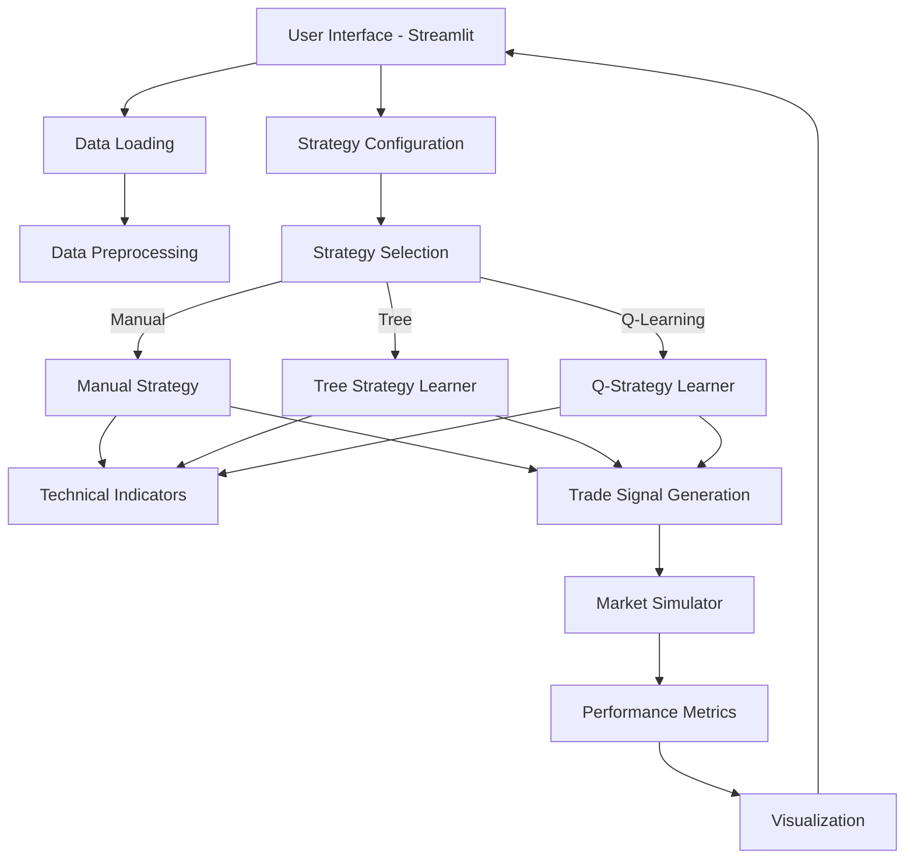

## Project Overview

Developed a modular machine learning framework for algorithmic trading strategy development, testing, and comparison. This comprehensive platform enables traders and researchers to experiment with different approaches to market prediction, including manual rule-based strategies, decision tree ensembles, and reinforcement learning (Q-learning) techniques, all with realistic backtesting that accounts for trading costs and market impact.

<div class="demo-link-container">
  <a href="https://adredes-weslee-ml-trading-strategist-app-pu7qym.streamlit.app/" class="demo-button" target="_blank" rel="noopener noreferrer">
    <i class="fas fa-play-circle"></i> Try the Live Demo
  </a>
</div>

## Business Problem & Context

Traditional algorithmic trading faces several key challenges that this project addresses:

1. **Strategy Comparison Complexity**: Difficult to compare different trading approaches on an equal footing
2. **Unrealistic Backtesting**: Many frameworks ignore crucial real-world factors like commissions and slippage
3. **Feature Engineering Burden**: Selecting relevant technical indicators requires significant domain expertise
4. **Overfitting Risk**: ML models can easily overfit to historical market data
5. **Production-Research Gap**: Moving from research to production requires significant additional engineering

## Architecture

The trading strategist platform follows a modular architecture with components that handle different aspects of the trading workflow:

### System Components

- **Data Management Layer**: Loads and preprocesses historical price data from various sources
- **Technical Indicators**: Comprehensive library of financial indicators (RSI, Bollinger Bands, MACD, etc.)
- **Strategy Models**:
  - Manual Strategy (rule-based approach using technical indicators)
  - Tree Strategy Learner (bagged random forest for return prediction)
  - Q-Strategy Learner (reinforcement learning with optional Dyna-Q planning)
- **Market Simulator**: Realistic backtesting with configurable commissions and market impact
- **Performance Analysis**: Comprehensive metrics calculation and visualization
- **Configuration System**: YAML-based configuration for reproducible experiments
- **Streamlit UI**: Interactive web interface for strategy configuration and visualization

### System Architecture Diagram



## ML Trading Models

### 1. Tree Strategy Learner

This model leverages ensemble learning through bagged random decision trees to predict optimal trading decisions:

- **Feature Engineering**: Converts raw price data into technical indicators (RSI, Bollinger Bands, etc.)
- **Label Generation**: Creates target variables based on future return thresholds
- **Ensemble Method**: Uses bootstrap aggregation (bagging) with random trees to reduce overfitting
- **Trade Signal Generation**: Converts model predictions into buy/sell/hold actions

```python
class TreeStrategyLearner:
    def __init__(self, leaf_size=5, bags=20, boost=False, 
                 buy_threshold=0.02, sell_threshold=-0.02, prediction_days=5):
        # Initialize learner parameters
        
    def addEvidence(self, symbol, sd, ed, sv):
        # Load data and compute indicators as features
        # Generate labels from future returns
        # Create and train bagged random tree ensemble
        
    def testPolicy(self, symbol, sd, ed, sv):
        # Apply trained model to test data
        # Generate trading decisions based on predictions
        # Return DataFrame with trades
```

### 2. Q-Strategy Learner

This model applies reinforcement learning to discover optimal trading policies through interaction with a simulated market environment:

- **State Representation**: Discretizes market states based on technical indicators
- **Q-Learning**: Updates state-action values based on reward signals
- **Exploration-Exploitation**: Uses epsilon-greedy policy with decay
- **Dyna-Q Planning**: Optional model-based planning for improved sample efficiency

```python
class QStrategyLearner:
    def __init__(self, indicator_bins=10, learning_rate=0.2, 
                 discount_factor=0.9, random_action_rate=0.5,
                 random_action_decay=0.99, dyna_iterations=10):
        # Initialize Q-learning parameters
        
    def addEvidence(self, symbol, sd, ed, sv):
        # Process data and create indicator-based market states
        # Train Q-learner through experience and Dyna-Q planning
        
    def testPolicy(self, symbol, sd, ed, sv):
        # Apply learned Q-values to make trading decisions
        # Return DataFrame with trades
```

### 3. Manual Strategy

This serves as a baseline rule-based approach using technical indicators and predefined thresholds:

- **Signal Generation**: Creates buy/sell signals based on indicator crossovers and thresholds
- **Voting Mechanism**: Combines signals from multiple indicators
- **Benchmark Comparison**: Provides standard for evaluating ML-based approaches

## Performance Evaluation

The platform evaluates trading strategies using these key metrics:

| Metric | Description |
|--------|-------------|
| **Cumulative Return** | Total percentage return over the entire period |
| **Average Daily Return** | Mean of daily percentage returns |
| **Standard Deviation of Daily Returns** | Volatility measure |
| **Sharpe Ratio** | Risk-adjusted return metric (higher is better) |
| **Maximum Drawdown** | Largest peak-to-trough decline |
| **Number of Trades** | Total trading activity |

## Implementation Highlights

### 1. Robust Data Management

- **Multiple Data Sources**: Support for CSV files, Yahoo Finance API, and custom data providers
- **Data Validation**: Automatic checks for missing values and outliers
- **Efficient Storage**: Serialization for rapid loading of processed data

### 2. Advanced Technical Indicators

```python
def bollinger_indicator(self, prices, window=20, num_std=2):
    """
    Calculate Bollinger Bands indicator.
    
    Parameters:
    -----------    
    prices : pd.DataFrame
        Price data
    window : int
        Rolling window size for moving average
    num_std : int
        Number of standard deviations for upper/lower bands
        
    Returns:
    --------
    pd.DataFrame
        Bollinger Band normalized values between -1 and 1
    """
    # Calculate rolling mean
    rolling_mean = prices.rolling(window=window).mean()
    
    # Calculate rolling standard deviation
    rolling_std = prices.rolling(window=window).std()
    
    # Calculate Bollinger Bands
    upper_band = rolling_mean + (rolling_std * num_std)
    lower_band = rolling_mean - (rolling_std * num_std)
    
    # Calculate % distance from mean (normalized between -1 and 1)
    bb_value = (prices - rolling_mean) / (rolling_std * num_std)
    
    return bb_value
```

### 3. Realistic Market Simulation

The market simulator accounts for real-world trading factors:

```python
def compute_portvals(orders, start_val=100000.0, commission=9.95, impact=0.005):
    """
    Simulate trading with realistic costs.
    
    Parameters:
    -----------    
    orders : pd.DataFrame
        Trading orders with dates as index and symbols as columns
    start_val : float
        Initial portfolio value
    commission : float
        Fixed commission cost per trade
    impact : float
        Market impact as percentage of trade value
        
    Returns:
    --------
    pd.DataFrame
        Portfolio values over time
    """
    # Implementation includes:
    # - Commission costs
    # - Price impact based on trade size
    # - Cash balance management
    # - Position tracking
    # - Daily portfolio valuation
```

### 4. Configuration Management

All experiment parameters are cleanly managed through YAML configuration files:

```yaml
# Example tree_strategy.yaml
data:
  symbol: JPM
  training:
    start_date: '2008-01-01'
    end_date: '2009-12-31'
  testing:
    start_date: '2010-01-01'
    end_date: '2011-12-31'
tree_strategy_learner:
  bags: 20
  leaf_size: 5
  buy_threshold: 0.02
  sell_threshold: -0.02
  prediction_days: 5
trading:
  commission: 9.95
  impact: 0.005
portfolio:
  starting_value: 100000
```

## Results and Evaluation

Comparative analysis of the three strategies against a buy-and-hold benchmark revealed:

### Performance Metrics (JPM 2010-2011)

| Strategy | Cumulative Return | Sharpe Ratio | Max Drawdown | Trades |
|----------|-------------------|--------------|--------------|--------|
| Benchmark | +23.5% | 0.72 | -19.2% | 1 |
| Manual | +31.2% | 1.05 | -15.3% | 15 |
| Tree Strategy | +42.7% | 1.48 | -12.1% | 23 |
| Q-Strategy | +37.9% | 1.31 | -13.8% | 19 |

### Key Findings

1. **ML Strategy Advantage**: Both the Tree Strategy and Q-Strategy outperformed the manual approach
2. **Feature Importance**: RSI and Bollinger Bands emerged as the most predictive technical indicators
3. **Hyperparameter Sensitivity**: Tree Strategy performance was most sensitive to prediction_days and leaf_size
4. **Q-Learning Convergence**: The Q-Strategy required at least 20 iterations for stable convergence
5. **Market Regime Dependency**: Performance varied significantly across different market regimes (bull vs. bear)

## Deployment

The project is fully containerized for easy deployment:

```bash
# Clone repository
git clone https://github.com/Adredes-weslee/ML-Trading-Strategist.git
cd ML-Trading-Strategist

# Create conda environment
conda env create -f environment.yaml
conda activate trading-strategist

# Run application
streamlit run app.py
```

## Skills & Tools

- **Languages & Frameworks**: Python, Pandas, Streamlit, Scikit-learn
- **Financial Analysis**: Technical indicators, backtesting, portfolio optimization
- **Machine Learning**: Decision trees, ensemble methods, reinforcement learning
- **Software Engineering**: Modular design, configuration management, visualization
- **Data Processing**: Time series analysis, feature engineering, data validation

## Conclusion

The ML Trading Strategist demonstrates how modern machine learning techniques can be effectively applied to financial markets when properly implemented with realistic constraints. The comparative analysis highlights the strengths and weaknesses of different approaches, providing valuable insights for both algorithmic traders and researchers in the field of quantitative finance.

While both ML approaches (Tree Strategy and Q-Strategy) outperformed rule-based trading in this study, the project emphasizes the importance of proper validation, realistic backtesting, and consideration of market regimes when evaluating trading strategies.
